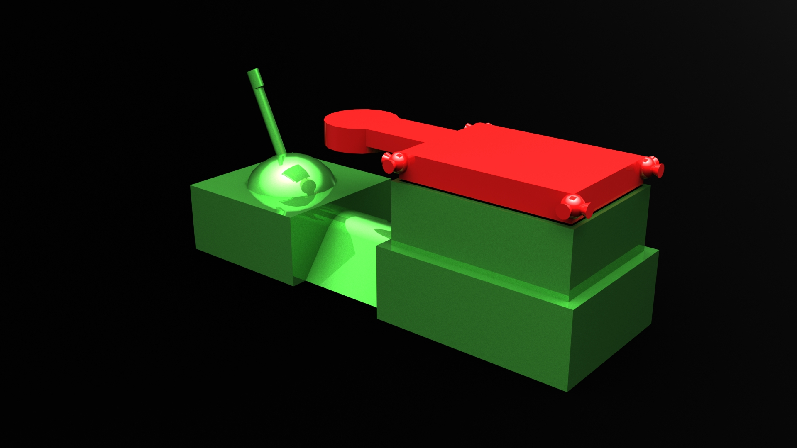
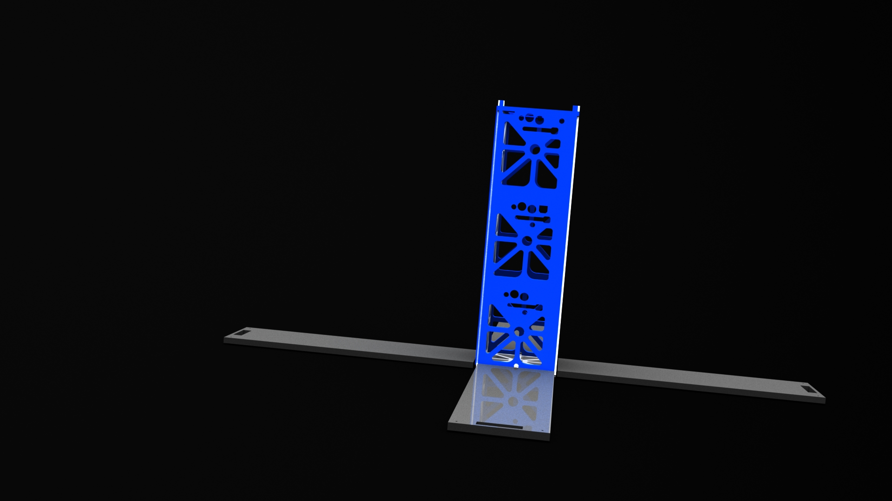

### Satellite measuring particle cloud after impactors make contact with near earth object

-----

### Rendered image of drone depositing minerals in lander for processing

-----

### Rendered image of sensor drone deployed and taking measurements
