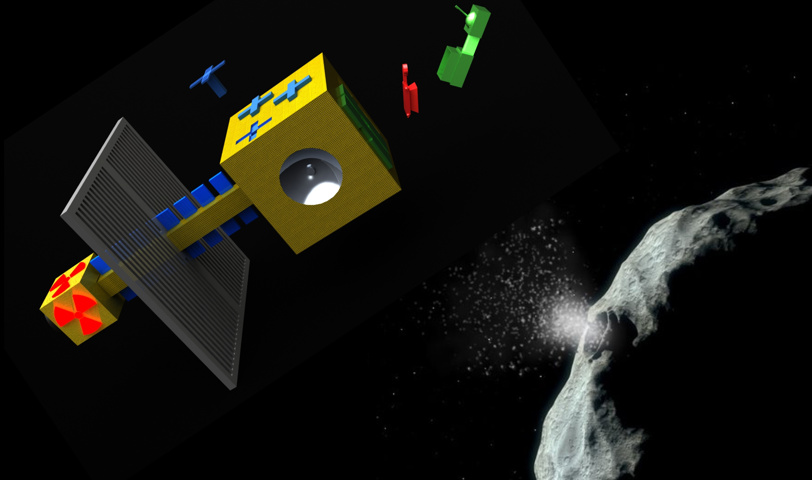

# Project Name: Star-Whals
https://github.com/starwhals/2016-spaceapps-neo-mining

## Project Description
We are developing a mission profile to obtain scarce, useful material and scientific data from a Near Earth Orbit (NEO) asteroid.

The first step is identifying a target asteroid composed of desirable material and orbital characteristics (size, location, velocity, etc.) This allows for the asteroid to be moved into a stable orbit in close proximity to Earth. This will facilitate economical access for mining and scientific research.

A spacecraft is then designed to travel to the asteroid, verify its composition through a sensory study of impact scattered material, attach landers to the asteroid, then move it into a close Earth orbit at Lagrange Point (L1). The movement of the asteroid will be accomplished through a combination of ion propulsion, mass ejection of asteroid material, and gravity tug.

## Background
This project was developed in response to the 2016 NASA SpaceApps, [Asteroid Mining Challenge](https://2016.spaceappschallenge.org/challenges/solar-system/asteroid-mining), location: NASA Glenn Research Center, Cleveland, OH

## 3D Models
Several 3d models were created for the purpose of generating animations to help explain the plan for obtaining a Near Earth Object for mining.  Those models are included in this project [here](MODELS.md)

## Additional images
There are several more 3D renderings and orbital images located [here](IMAGES.md)

## Orbital Video of 2000 SG344 (desired target)
View animation which details timing for desired asteriod for first mining mission [here](videos/orbit_video.mp4)

## Resources Used for researching
The decisions, designs, and approaches used as part of this solution are based on research detailed in [these resources](RESOURCES-USED.md)

## License

The materials in this repository as available as open source under the terms of the [MIT License](license.md)
