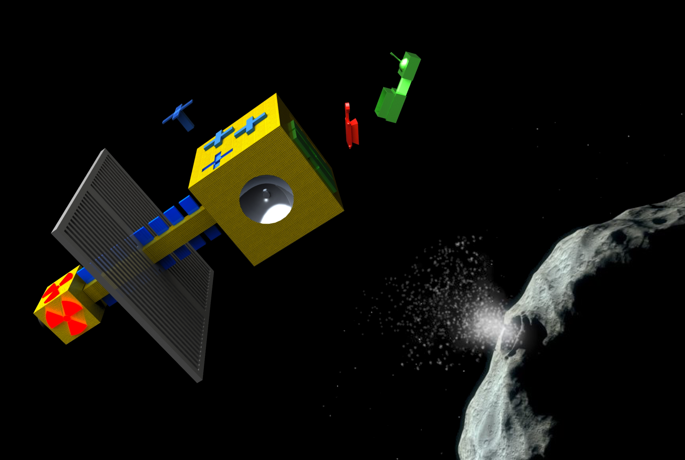

# Project Name: Star-Whals
https://github.com/starwhals/2016-spaceapps-neo-mining

TODO: EXPLAIN YOUR SOLUTION

Project Description:
Develop a program to obtain scarce and useful material from a near earth orbit asteroid.

Identify a target asteroid composed of desirable material; that’s size, location, and velocity, allow it to be moved into a stable orbit in close proximity to earth, allowing economic access for mining.

Design a spacecraft which will: travel to the asteroid, verify its composition through a sensory study of impact scattered material, then move the asteroid into a close earth orbit through a combination of ion propulsion, mass ejection of asteroid material, and gravity tug. 

## Background
This project was developed in response to the 2016 NASA SpaceApps, [Asteroid Mining Challenge](https://2016.spaceappschallenge.org/challenges/solar-system/asteroid-mining), location: NASA Glenn Research Center, Cleveland, OH

## 3D Models
Several 3d models were created for the purpose of generating animations to help explain the plan for obtaining a Near Earth Object for mining.  Those models are included in this project [here](MODELS.md)

## Resources Used for researching
The decisions, designs, and approaches used as part of this solution are based on research detailed in [these resources](RESOURCES-USED.md)

## License

The materials in this repository as available as open source under the terms of the [MIT License](license.md)
